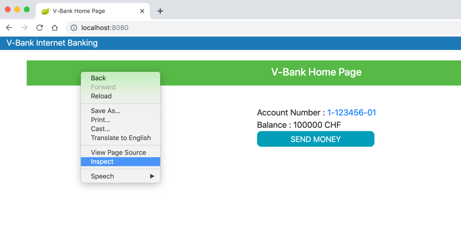
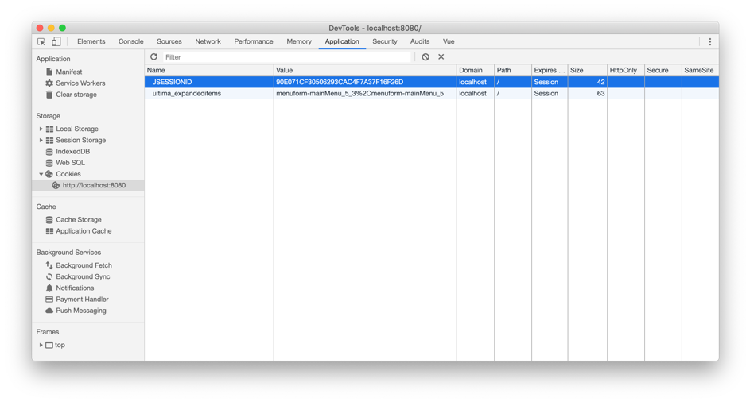
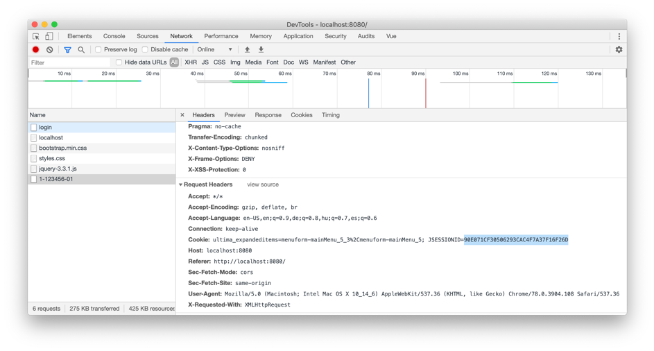
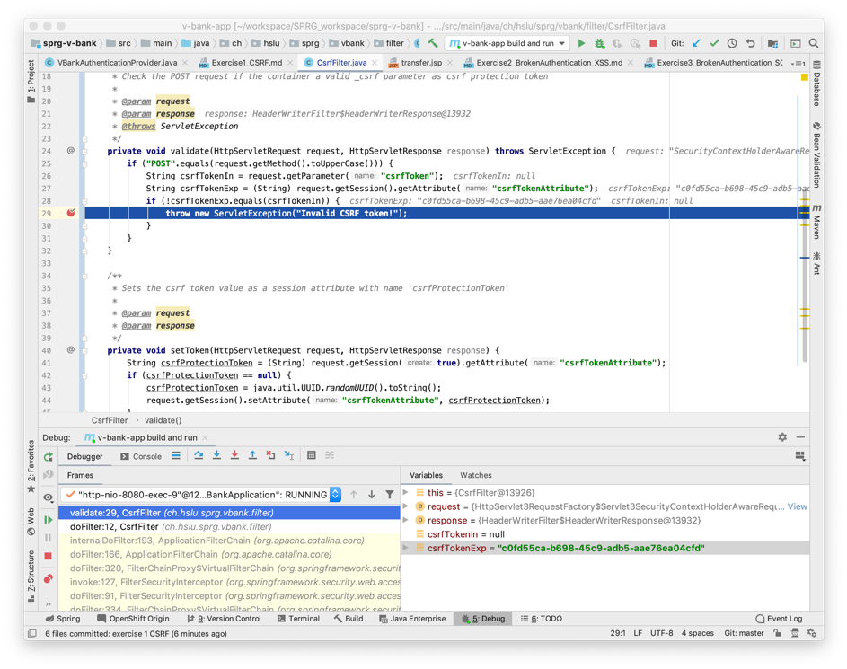

# Exercise 1 - CSRF

This exercise is to help you understand Cross Site Request Forgery and its most common mitigation.

## Setup and Start Applications

1. Start the application in debug mode
   * start the Maven configuration for the launch configuration "v-bank run and build" in DEBUG mode with the green BUG icon next to the arrow; (the launch configration should have been created as described [here](IntelliJSetup.md))
1. Open v-bank application and log in 
   1. Open http://localhost:8080/ in the browser
   1. Login as 'Victim' with password 'Victim_01'
     * You may open the file _data.sql_ to see what accounts have been created on application start
   1. Send some money (i.e. 100 CHF) to account 1-123456-02 with some intelligible comment 
   1. Go the transaction history page by clicking on the account number on the home page to see the transaction executed
1. Then on behalf of the Attacker user we execute a CSRF attack against the Victim user. For the sake of simulation we will wear both hats.
  1. Make sure that your are logged in as 'Victim' in the v-bank
  1. Now as the 'Victim' user open the below page in the same browser where v-bank transaction history page is opened:
     * http://sprg-tools.el.eee.intern/csrf_local.html
     * Open its source view (right click -> View Page Source)
```html
     <body onload="document.forms.item(0).submit(); document.getElementById('h3').innerText='Your CSRF request has been successfully sent.'">
     <h2 class="hello-title">Thank you for visiting this page.</h2><h3 id="h3"></h3>
     <form action="http://localhost:8080/doTransfer" method="post" target="hiddenFrame" id="csrfTransferForm">
         <input name="fromAccountNo" type="hidden" value="1-123456-01">
         <input name="toAccountNo" type="hidden" value="1-123456-07">
         <input name="amount" type="hidden" value="1000">
         <input name="currency" type="hidden" value="CHF">
         <input name="comment" type="hidden" value="You have been CSRF-d!">
     </form>
```  
 * It contains a populated hidden form with the Victim's and the Attacker's account number.
 * It submits the form automatically on page load (body.onload attribute)
 * The Victim will not see anything from this as the response of the CSRF request is targeted to a hidden frame.
 1. Then go back to the transactions page and refresh it.  
       You should see that you are 1000 CHF worse off because "you have been CSRF-ed"
  
## Understand how the CSRF attack works 

1. Make sure that you are logged in as user Victim
1. Open Google Chrome Devtools (left click on the v-bank page)

   1. Go to the Application tab and check the session cookie holding the session id value
   
   1. Go to the Network tab and have a look at how the session ID is attached to the request as Cookie header. The name of the cookie holding the session ID is JSESSIONID.   
   
2. Switch the browser tab to the page with the CSRF exploit and check the requests sent to http://localhost:8080/doTransfer
    **You need to open a new instance of DevTool for the CSRF page and then reload to see the network traffic.**
   You should see that the post request sent by http://sprg-tools.el.eee.intern/csrf_local.html contains the same session Id value in the Cookie header.
   
   The session ID value from the session cookie is added to the Cookie header of each request to the respective domain and path (localhost:8080/) automatically by the browser regardless of the page the request originates from.
## Mitigations
* Possible mitigations against CSRF
  * Protect session cookie with same-site attributes 
    * 'lax' if normal GET requests are safe and modifications are behind POST (or PUT/DELETE)
    * 'strict' otherwise
    * Unfortunately,it depends on the web-framework / server / browser wether it is supported (well, especially with older tech).
  * Protect forms with CSRF token
    * additional token to validate state changing requests. This token is not stored as a cookie, hence is not automatically added to every request by the browser. 
For a more detailed explanation please refer to https://github.com/OWASP/CheatSheetSeries/blob/master/cheatsheets/Cross-Site_Request_Forgery_Prevention_Cheat_Sheet.md

## Fix
* Since same-site session cookies are not supported by the current application framework (JEE Servlet 2.3 and Spring 5) we have to revert to other methods
* Spring security support CSRF tokens out of the box, which is disabled in this exercise so that CSRF can be demonstrated. 
* We are going to add our own CSRF filter (filter means that it intercepts all incoming requests and responses and can block/change them) instead to understand how token based mitigation works against CSRF.\
The code of a simple anti CSRF filter:
```java
package ch.hslu.sprg.vbank.filter;

import javax.servlet.*;
import javax.servlet.http.*;

@org.springframework.stereotype.Component
@org.springframework.core.annotation.Order(1)
public class CsrfFilter implements Filter {

    @Override
    public void doFilter(ServletRequest request, ServletResponse response, FilterChain chain) throws java.io.IOException, ServletException {
        validate((HttpServletRequest) request, (HttpServletResponse) response);
        chain.doFilter(request, response);
        setToken((HttpServletRequest) request, (HttpServletResponse) response);
    }

    /**
     * Check the POST request if the container a valid _csrf parameter as csrf protection token
     *
     * @param request
     * @param response
     * @throws ServletException
     */
    private void validate(HttpServletRequest request, HttpServletResponse response) throws ServletException {
        if ("POST".equals(request.getMethod().toUpperCase())) {
            String csrfTokenIn = request.getParameter("csrfToken");
            String csrfTokenExp = (String) request.getSession().getAttribute("csrfTokenAttribute");
            if (!csrfTokenExp.equals(csrfTokenIn)) {
                throw new ServletException("Invalid CSRF token!");
            }
        }
    }

    /**
     * Sets the csrf token value as a session attribute with name 'csrfProtectionToken'
     *
     * @param request
     * @param response
     */
    private void setToken(HttpServletRequest request, HttpServletResponse response) {
        String csrfProtectionToken = (String) request.getSession(true).getAttribute("csrfTokenAttribute");
        if (csrfProtectionToken == null) {
            csrfProtectionToken = java.util.UUID.randomUUID().toString();
            request.getSession().setAttribute("csrfTokenAttribute", csrfProtectionToken);
        }
    }
}
```  
This component is a so called filter, it intercepts (filters) all incoming HTTP requests and does two things:
1. First, it checks if the CSRF token exists in the session. If not it creates a token and saves it in the session as a session attribute.\
The view component should read it from the session and place it in the form as a hidden value. (Template languages, such as JSP, usually provide easy ways to read session attributes.)
1. Second, and most importantly, verifies all incoming requests of POST http method if they contain a valid CSRF token by reading the token value from the request parameters and comparing it with the value saved in the session.  
(It checks only POST requests because those are meant to write resources, i.e. create money transactions in our case; please note that PUT/DELETE/PATCH requests can only be made as XHR requests with JavaScript to which the browser does not append cookies automatically)  
It throws an Exception if there is no valid CSRF token value coming in as a parameter with the POST request.
\
Add the a hidden input of name *csrfToken* to the transfer form in *transfer.jsp* to make sure that the CSRF token value is sent as a parameter with the POST request when saving the transaction:\
`<input type="hidden" name="csrfToken" value="${csrfTokenAttribute}"/>`
\(in __transfer.jsp__)
### Apply fix
* Copy-paste above code into CsrfFilter.java (the file itself as a placeholder is prepared for you).
* Open *transfer.jsp* and verify that the token is being placed into the form:
```xml
<input type="hidden" name="csrfToken" value="${csrfTokenAttribute}"/>
```

## Verify fix
Having added the CsrfFilter and the token parameter to the form the CSRF request from the attacker site should be blocked.
You can verify it by placing a break-point in *CsrfFilter.validate(...)*
1. So please put a breakpoint at CsrfFilter.java:29 (line 29)
1. Open the CSRF page at http://sprg-tools.el.eee.intern/csrf_local.html  
Your break-point should be hit and you should see it block the request and throw _ServletException("Invalid CSRF token!")_

1. Send a transaction again via the transaction page  
This time the request should go through and your break-point should not be hit as it contains a valid CSRF token.
