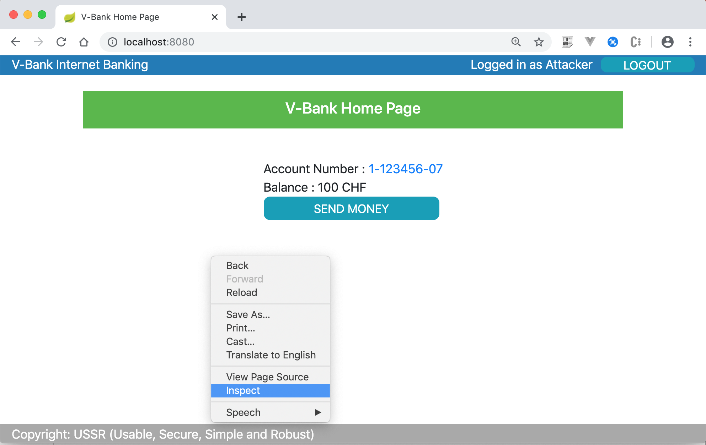
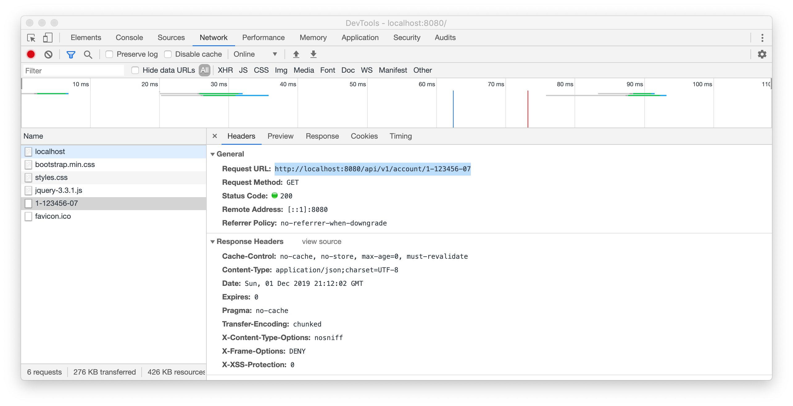

# Exercise 4 - Broken Object Level Authorization
In this exercise we are going to have a look at a typical authorization problem 
when backend services are exposed via HTTP.

The "home" page of the v-bank application is a hybrid of modern and traditional web technologies. 
It uses asynchronous requests to fetch account data from the backend and javascript to show it on the page. 
Requests to the account information service are badly authorized, which we will exploit.   

## Find the vulnerability and exploit it
1. Login to the the v-bank app as the 'Attacker' user and open Google Developer Tools (left click -> Inspect) 

1. Go to the Network tab. (You may need to reload the page to see requests made to the backend.)

1. Find the URL of the account information service (hint: it ends with the account number) and copy-paste it into the address bar.  
This should return a JSON (JavaScript Object Notation) data structure, i.e. `{"accountNo":"1-123456-07","ownerId":"Attacker","balance":100,"currency":"CHF"}`  
Please try to change the account number in the URL, you should be able to read account information of any existing account number.  
Hint: the Victim's account number is 1-123456-01; his account information can be fetched with the URL http://localhost:8080/api/v1/account/1-123456-01  
**One should not be able to access account information of any other account than his or hers.**
## Fix the vulnerability
1. The faulty method is `AccountServiceResource.getAccountDetails()`. The `AccountServiceResource` class is basically a HTTP and REST adapter of the `AccountService` component.
```java
    @RequestMapping(path = "/api/v1/account/{accountId}", produces = "application/json")
    public ResponseEntity<AccountDetails> getAccountDetails(@PathVariable("accountId") String accountId) throws Exception {
        if (request.isUserInRole("ACCOUNT_HOLDER")) {
            AccountDetails accountDetails = delegate.getAccountDetails(accountId);
            return ResponseEntity.ok(accountDetails);
        }
        return ResponseEntity.status(HttpStatus.FORBIDDEN).build();
    }
```  
It maps HTTP request parameters to actual method parameters, delegates the call to the actual component implementing `AccountService` and transforms the results to JSON and/or HTTP status codes.

It also does some very simple access control: it only checks if the user is in the ACCOUNT_HOLDER role.

However, it forgets to verify the relation between the user and and the accessed account (between the subject and object).   
This has to be fixed, you should check if the current user is the one associated with the account, otherwise return a FORBIDDEN status code:
```java
        String user = request.getUserPrincipal().getName();
        if (user.equals(accountDetails.getOwnerId())) {
            return ResponseEntity.ok(accountDetails);
        }
```